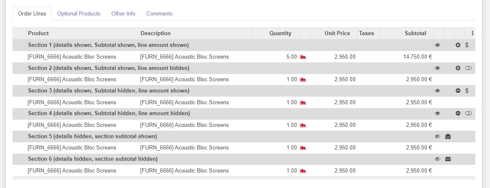
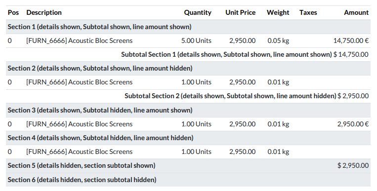

The flags on the right hand side of the sale order line allow you to show or
hide details, subtotal, line amount and section subtotal.

These are the possible combinations:

And these are the results in report:

The behavior described before is the same for Quotations and Invoices.

.. |eye-icon| image:: ../static/description/readme-icons/eye.png
   :alt: plus-circle icon
   :width: 12 px

