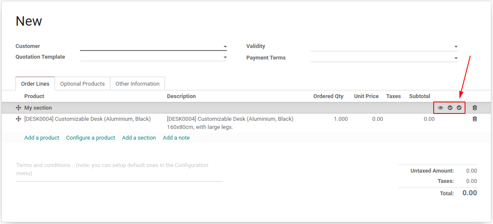
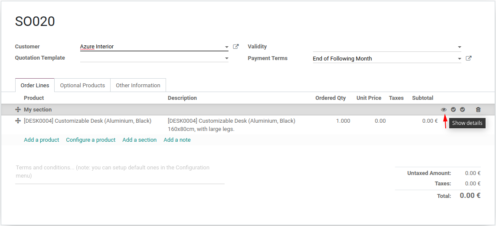
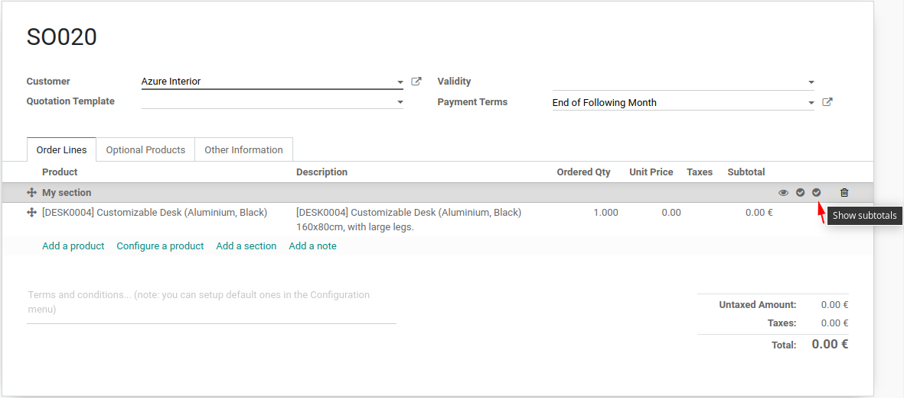

To use this module, you need to:

#. Go to *Sales -> Orders -> Quotations* and create a new *Quotation*.
#. In *Order lines* tab add a section line.
#. Add some product lines.
#. Toggle the feature buttons
#. Print a *Quotation / Order* report for this quotation.

.. image:: ../static/description/show_prices.png

The behavior described before is the same for Quotations and Invoices.
